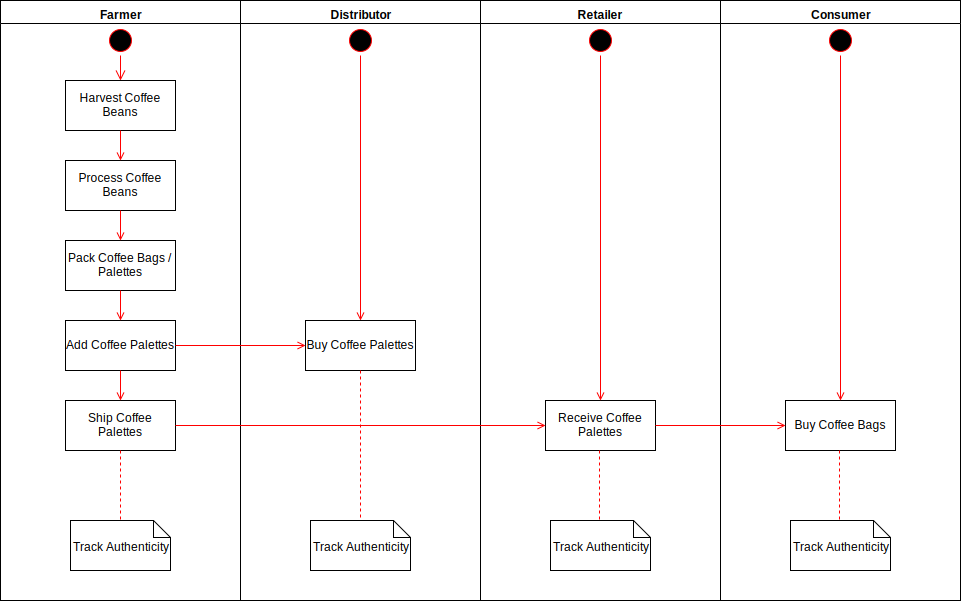
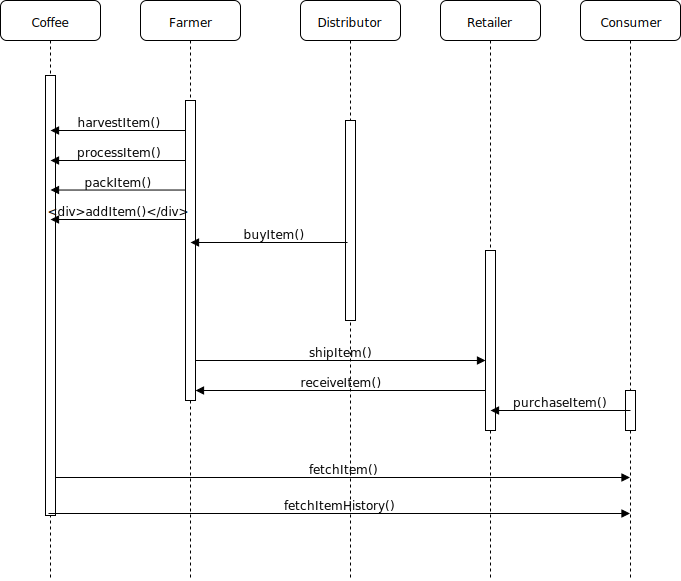

# Supply chain DAPP

The following repository contains the Supply Chain DAPP for the
[Udacity Blockchain Term 2 Project 6](https://www.udacity.com/course/blockchain-developer-nanodegree--nd1309).
At present only the diagrams in this README are provided for Part A.
In the future Part B will complete the code and provide implementation details.
The initial skeleton code use in this repository is provided by Udacity from
[here](https://github.com/udacity/nd1309-Project-6b-Example-Template).
The goal of this DAPP is to track a coffee supply chain.

# Coffee Supplly Chain Diagrams

## Activity

## Sequence

## State

## Class

