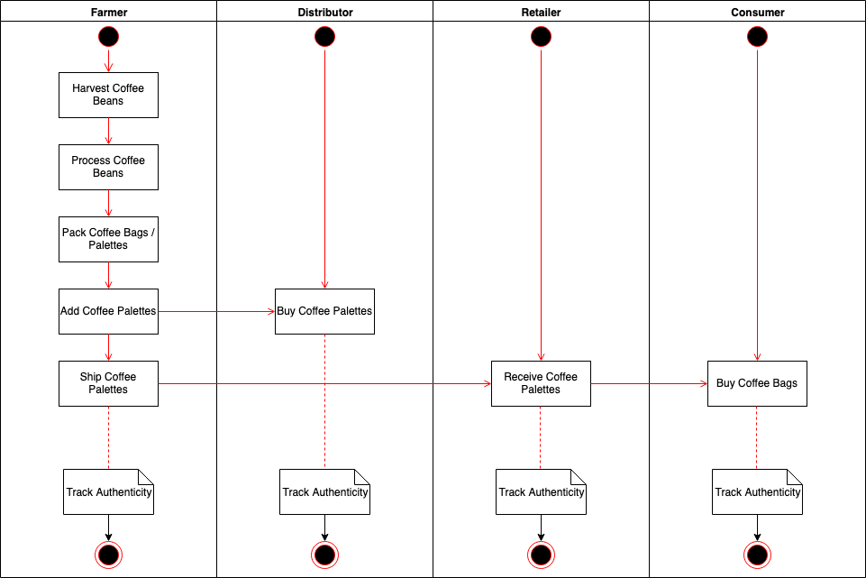
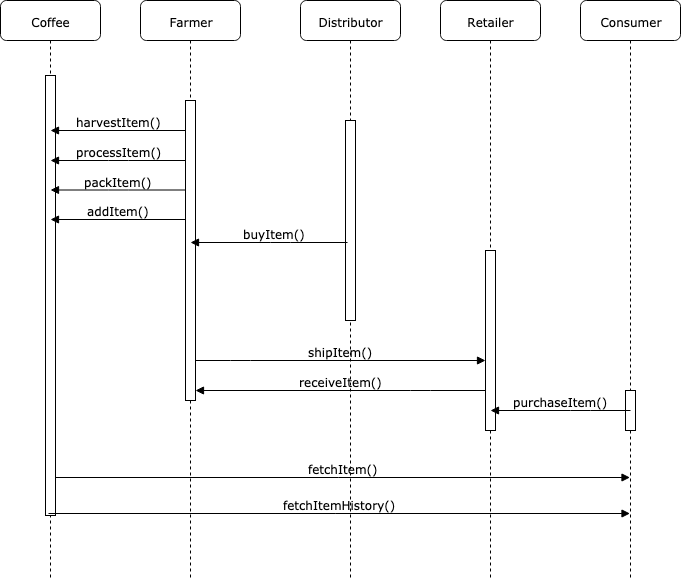
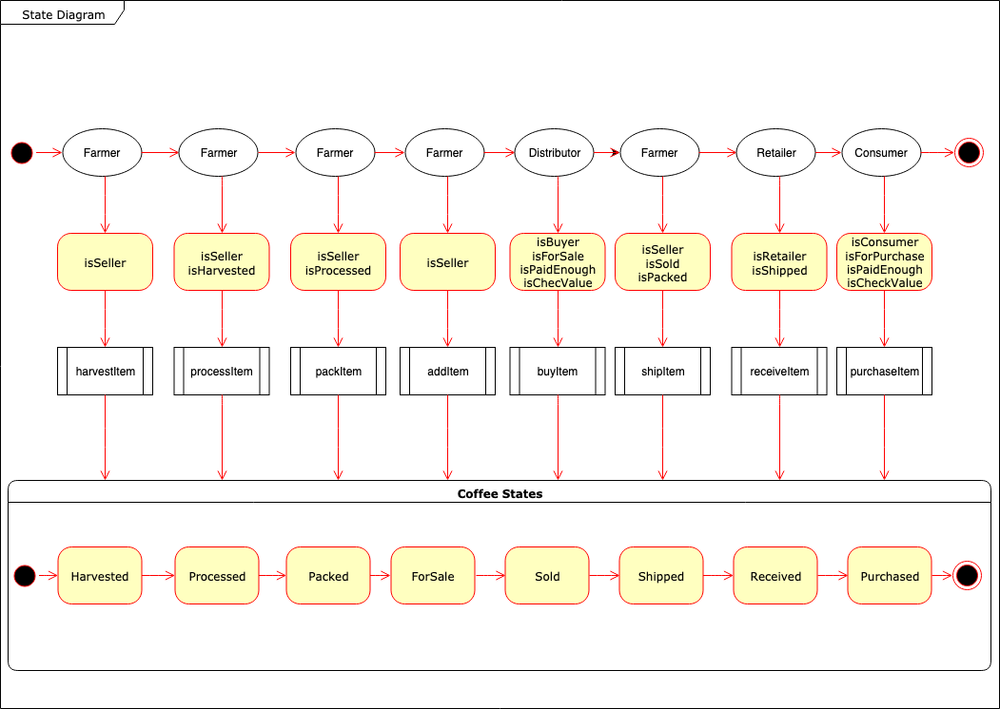
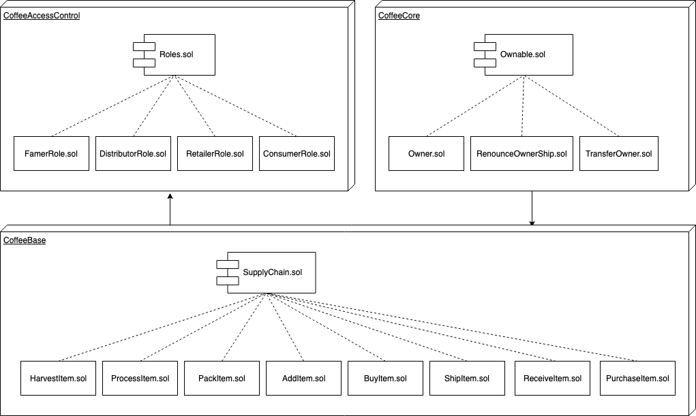

# Supply chain DAPP

A coffee bean supply chain is tracked via this Ethereum DAPP.
The DAPP was completed for the
[Udacity Blockchain Term 2 Project 6 Part B](https://www.udacity.com/course/blockchain-developer-nanodegree--nd1309).
The diagrams for Part A are in the

section towards to end of this document.
The initial skeleton code use in this repository is provided by Udacity from
[here](https://github.com/udacity/nd1309-Project-6b-Example-Template).

## Software Versions Used

- Truffle v4.1.15 (core: 4.1.15)
- Solidity v0.4.25 (solc-js)

# Local Test Instructions

- Install the truffle version specified in the
  [Software Version Used](#Software-Versions-Used)
  section.
- Install browser extension [MetaMask](https://metamask.io/).
- Start the `Ganache GUI`.
- Import the accounts from the `Ganache GUI` to metamask.
- All the following commands should be run in the `project-6` directory.
- Run the contract tests via: `truffle test --network ganachegui`.
- Deploy the contract by running the following command in the :
  `truffle migrate --compile-all --reset --network ganachegui`.
- Start the GUI by running `npm run dev`.
- Use the web browser button in the following order to verify the contract:
  - Harvest
  - Process
  - Pack
  - ForSale
  - Buy
  - Ship
  - Receive
  - Purchase
  - Fetch Data 1
  - Fetch Data 2
- The ganache GUI

# Implementation Notes

- In order not to be able to

# Rinkeby Execution Instructions

The contract was deployed to the Rinkeby network under the following addresses

- 0xabce, and
- 0xabcd.

The first contract address allows anyone to add roles to the contract.
The second contract only allows the deployer to add roles to the contract.
Line xx in SupplyChain.sol is what is different between the two contracts.

The contract

## Coffee Supplly Chain Diagrams

### Activity

### Sequence

### State

### Class

# Notes

Can ignore everything below this as I use it as a scratch pad.

Read students comment up to date Feb 20/2019.
